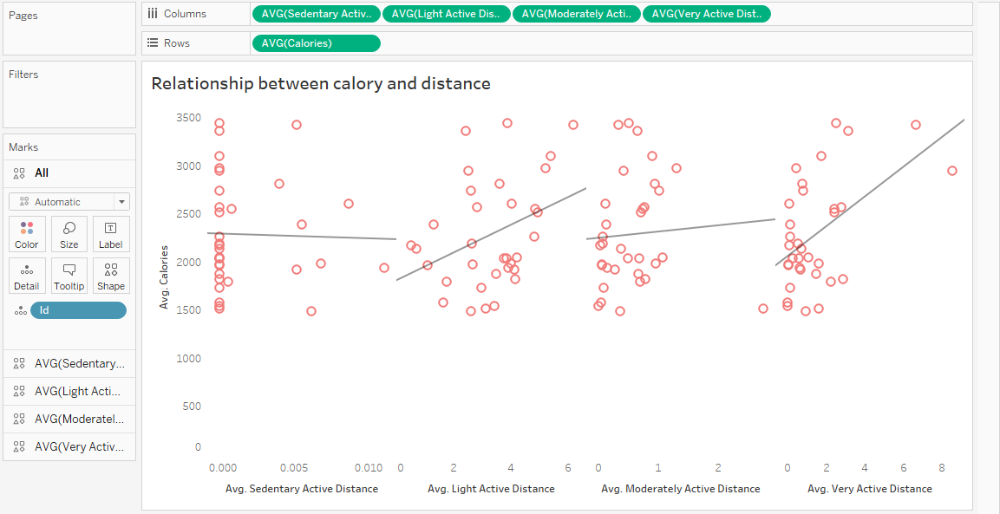

# Bellabeat_Capstone_Project
## Bellabeat Data Analysis Documention

## STEP 1: ASK
Here, we are going to define the problem and objective of our case study and its desired outcome.

## INTRODUCTION:
This project is a Google data analytics capstone project aimed at making informed data driven decision for a wellness company named *Bellabeat*. Bellabeat is a high-tech manufacturer of health-focused products for women. Urška Sršen, cofounder and Chief Creative Officer of Bellabeat, believes that analyzing smart device fitness data could help unlock new growth opportunities for the company. As a junior data analyst, I have been tasked to analyze smart device data to gain insight into how consumers are using their smart devices.

## BUSINESS TASK:
Analysis of Fitbit Fitness Tracker data to gain insight into how consumers use Fitbit app and discover trends for Bellabeat marketing strategy.

## BUSINESS OBJECTIVES:
- What are some trends in smart device usage?
- How could these trends apply to Bellabeat customers?
- How could these trends help influence Bellabeat marketing strategy?

## WHAT TO EXPECT:
- A clear summary of the business task
- A description of all data sources used
- Documentation of any cleaning or manipulation of data
- A summary of analysis
- Supporting visualizations and key findings
- High-level content recommendations based on the analysis

## STAKEHOLDERS:
1. Urška Sršen: Bellabeat’s cofounder and Chief Creative Officer 
2. Sando Mur: Mathematician and Bellabeat’s cofounder; key member of the Bellabeat executive team
3. Bellabeat marketing analytics team: A team of data analysts responsible for collecting, analyzing, and reporting data that helps guide Bellabeat’s marketing strategy.

## PRODUCTS:
1. Bellabeat app: The Bellabeat app provides users with health data related to their activity, sleep, stress, menstrual cycle, and mindfulness habits.
2. Leaf: Bellabeat’s classic wellness tracker can be worn as a bracelet, necklace, or clip. The Leaf tracker connects to the Bellabeat app to track activity, sleep, and stress.
3. Time: This wellness watch combines the timeless look of a classic time piece with smart technology to track user activity, sleep, and stress.
4. Spring: This is a water bottle that tracks daily water intake using smart technology to ensure that you are appropriately hydrated throughout the day. 

# STEP 2: PREPARE
In prepare phase, we are going to identify the data been used and its limitation

## DATASOURCE:
Data is publicly available on [Kaggle](https://www.kaggle.com/datasets/arashnic/fitbit). It is an open source data and contains 18 csv files. 30 FitBit user consented to the use of their personal data. Data collected includes physical activities, sleep monitoring, weight, calories, heart rate, daily activities and steps.

## LIMITATIONS TO DATA:
- Data was collected in 2016 (7 years ago). Users activities might have change over the time. Therefore, the data is not relevant or timely
- Sample size of 30 people is not a good representation of the whole fitness population.

## IS DATA ROCCC: (Reliable, Original, Comprehensive, Cited, Current)
1. RELIABLE: It has only 30 repondents, LOW
2. ORIGINAL: Third party provider, LOW
3. COMPREHENSIVE: Parameters match Bellebeat product parameters, HIGH
4. CITED: Unknown, LOW
5. CURRENT: Data is 7 years old, LOW
**The dataset is considered bad quality and not advisable for business decision**

## TOOL:
- We are going to use MS Excel for data cleaning
- Tableau for data transformation and visualization

# STEP3: PROCESS
Here, we will process the data by cleaning and ensuring that it is correct, relevant, complete and free of error

## IMPORTING THE DATA:
The data was imported into MS Excel using the import option

## DATA CLEANING:
1.	We did an overview of the data
2.	Check for null and missing data
The data appears to be free of null values
3.	Using excel functions, we checked basic information about the data

## DATA TRANSFORMATION
4.	The columns were formatted correctly
5.	The data was loaded into tableau for further analysis

# STEP 4: ANALYSIS
Various analysis were carried out which would be fully explained in the next step

# STEP 5: SHARE
In this step, we are creating visualizations and communicating our findings based on our analysis.

## 1. Weekday users uses the app most
Here, we use the count function to count number of times the app was used and extracted weekday from activity date

## 2. Relationship between calory and total step
Here, we analysed to check if there is a relationship between calory and total steps. Using, scattered plot, we constructed the sum of calories against total steps and used ID as marks

## 3. Workout hour
Using line charts, we analysed the time of day users like to workout most. We extracted hour of day from the activity date and constructed the graph against average intensity

## 4. Hours in bed
We further analysed the data to determine on average the day users stay in bed the most. We extracted day from activity date and constructed the graph adainst hours in bed

## 5. Relationship between calory and distance
We concluded the analysis by constructing a scattered plot to view the relationship between calories and distance taken

# STEP 6: ACT
In this final step, we will be delivering our insights and providing recommendations based on our analysis.

**Business Question 1: What are the trends identified?
- Majority of FitBit user use the app to track sedentary activities and not health related habits
- On average, users track their activities more during weekdays
- Users stays in bed more during weekends and theirs a spike in workout during the hours of 1700-2000HRS

**Business Question 2: How could this trends apply to bellabeat customers?
- Both company are in the same industry and into the same production, producind app that tracks health and daily habits for women. Therefore, these common trends can very well apply to bellabeat customer

**Business Question 3: How could these trends help influence Bellabeat marketing strategy?
- Using the calories analysis, bellabeat can educate and advice their customers on the importance of exercise and its effect on the body. Thereby, encouraging them to track it using their app
- Also they can incluse notification in the app to prompt user do their exercise regularly.
